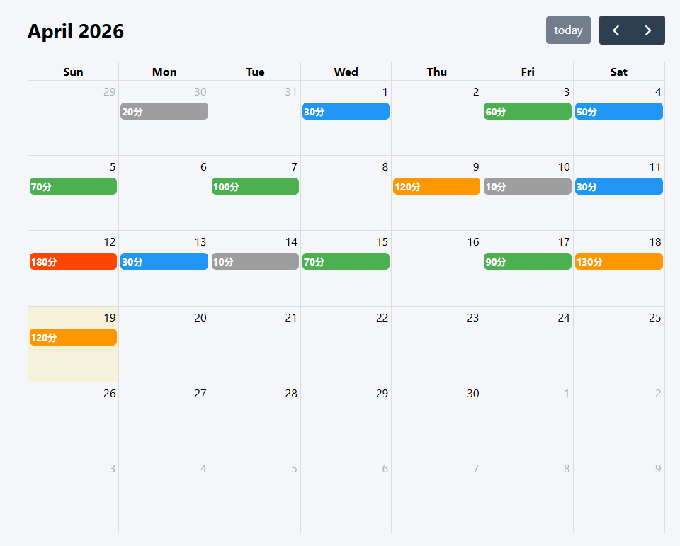
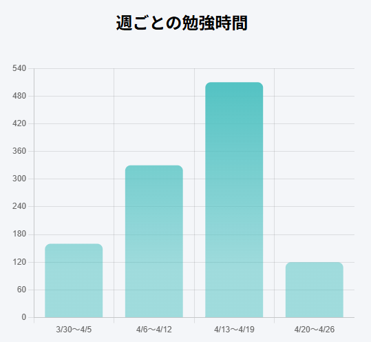
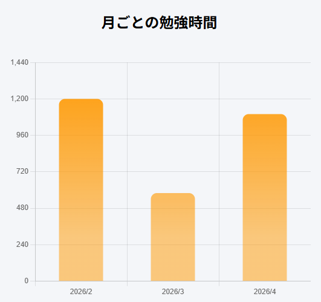
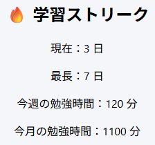

# 📚 Study Time Tracker


---

## 🎯 プロジェクト概要

学習習慣の継続に課題を感じ、勉強時間を記録・可視化するWebアプリを開発しました。
カレンダーとグラフを組み合わせることで、日々の学習状況と長期的な推移を直感的に把握できる設計としています。

---

## 🧠 課題と解決（評価されるポイント）

### ❌ 課題

* 勉強時間を記録しても振り返りづらい
* 継続状況が可視化されずモチベーションが低下
* 学習量を定量的に把握できない

### ✅ 解決

* カレンダーで日別の記録を直感的に可視化
* グラフで週・月単位の学習傾向を分析
* KPI表示で現在の学習量を即時確認可能に

---

## 🚀 成果

* 学習状況の可視化により継続意識が向上
* 自己管理がしやすくなり学習効率を改善
* UI改善を繰り返すことでユーザー視点の設計力を強化

---

## 🛠 技術構成

### バックエンド

* Java / Spring Boot
* REST API設計

### フロントエンド

* HTML / CSS / JavaScript
* FullCalendar（カレンダーUI）
* Chart.js（データ可視化）

### その他

* fetch API（非同期通信）
* JSONデータ連携

---

## 💡 技術的工夫

* **状態管理のシンプル化**

  * 学習データを日付ベースで統一管理

* **UI/UX重視設計**

  * カレンダークリックのみで記録可能
  * グラフを自動更新し分析コスト削減

* **データの可視化**

  * 週・月の2軸で分析可能に設計
  * KPI（今週・今月）で即時把握

---

## 🔄 改善プロセス

初期は「記録のみ」の機能でしたが、

* 見返しづらい
* 継続につながらない

という課題が発生。

👉 以下を追加

* グラフ機能
* KPI表示
* UI改善

結果として、
「使われるアプリ」へ改善しました。

---

## 🖼 デモ / 画面

### 📅 カレンダー画面



### 📊 週グラフ



### 📈 月グラフ



### 🎯 KPI表示



---

## 🎥 デモ動画

👉 動画リンク貼る（YouTubeなど）

```
https://your-demo-link.com
```

---

## 📦 セットアップ

```bash
git clone https://github.com/your-username/study-tracker.git
cd study-tracker
```

```bash
mvn spring-boot:run
```

👉 http://localhost:8080

---

## 🔮 今後の展望

* ログイン機能（ユーザー管理）
* スマホ対応（レスポンシブ）
* 学習カテゴリ分析
* 目標設定機能

---

## 👤 作者

Yuto Makiura

---

## 📝 補足

本アプリでは、
「課題発見 → 解決 → 改善」のプロセスを意識して開発しました。

特に、

* ユーザー視点でのUI設計
* データの可視化による課題解決

に注力しており、実務でも活かせる開発経験を得ました。
